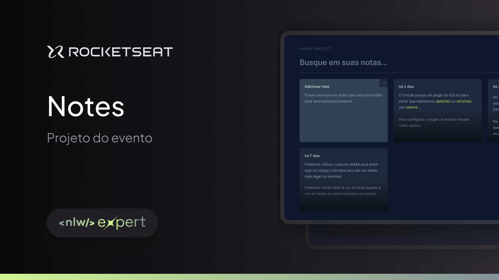

# nlw-expert-notes

Expert Notes é uma aplicação desenvolvida em aula no evento da NLW, nele é possivel criar notas pessoais transcrevendo sua fala em texto!
 
## Funcionalidades

- ✏️ Criar, editar e excluir notas pessoais.
- 🎤 Usar a SpeechRecognitionAPI para ditar notas por voz.
- 🖥️ Interface de usuário moderna, intuitiva e responsiva.
- 🛠️ Desenvolvido com Vite, TypeScript, Node.js, React, TailwindCSS, RadixUI e Sonner.

## Tecnologias Utilizadas

- 🟦 TypeScript
- ⚙️ Node.js
- ⚛️ React
- 🎨 TailwindCSS
- 🛠️ RadixUI
- 🗣️ SpeechRecognitionAPI
- 🍞 Sonner
  
## Licença

Este projeto está licenciado sob a [Licença MIT](LICENSE).
